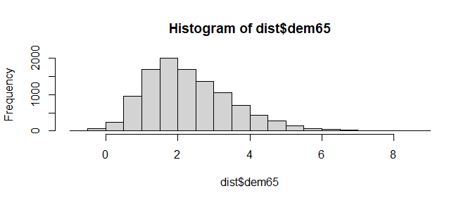
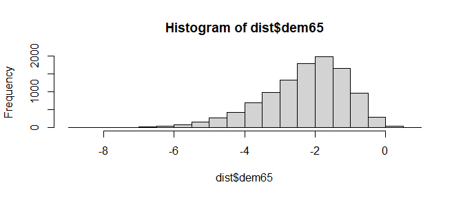

<!-- README.md is generated from README.Rmd. Please edit that file -->

# banSEM

banSEM (Bayesian network SEM) translates models fitted with lavaan to
Bayesian networks as implemented in the bnlearn package.

> **Warning**: banSEM is extremely experimental and not ready for use.
> It is just a playground to test the basic idea.

## Installation

You can install the development version of banSEM from
[GitHub](https://github.com/) with:

``` r
# install.packages("devtools")
devtools::install_github("jhorzek/netSEM")
```

## Example

``` r
library(lavaan)
library(banSEM)
model <- '
  # latent variable definitions
     ind60 =~ x1 + x2 + x3
     dem60 =~ y1 + a*y2 + b*y3 + c*y4
     dem65 =~ y5 + a*y6 + b*y7 + c*y8

  # regressions
    dem60 ~ ind60
    dem65 ~ ind60 + dem60

  # residual correlations
    y1 ~~ y5
    y2 ~~ y4 + y6
    y3 ~~ y7
    y4 ~~ y8
    y6 ~~ y8
'

lavaan_model <- sem(model,
                    data = PoliticalDemocracy,
                    meanstructure = TRUE)

network <- banSEM::banSEM(lavaan_model = lavaan_model)

# plot network
plot(network$dag)
```


``` r
# Check conditional distribution
# probability that dem65 in (1,2) given dem60 > 1:
bnlearn::cpquery(fitted = network$bayes_net,
                 event = (dem65 > 1 & dem65 < 2),
                 evidence = (dem60 > 1))
#> [1] 0.3370912

# Get distribution under this assumption:
dist <- bnlearn::cpdist(fitted = network$bayes_net,
                        node = "dem65",
                        evidence = (dem60 > 1))
hist(dist$dem65)
```



``` r

# Now check dem60 < -1
dist <- bnlearn::cpdist(fitted = network$bayes_net,
                        node = "dem65",
                        evidence = (dem60 < -1))
hist(dist$dem65)
```



``` r


# simulate data from the network and refit SEM to check if the estimates align:
sim <- bnlearn::rbn(x = network$bayes_net, n = 100000)

fit_sim <- sem(model,
               data = sim[,lavaan_model@Data@ov.names[[1]]],
               meanstructure = TRUE)
round(abs(coef(fit_sim) -
            coef(lavaan_model)) / abs(coef(lavaan_model)), 3)
#>    ind60=~x2    ind60=~x3            a            b            c            a 
#>        0.001        0.003        0.001        0.007        0.005        0.001 
#>            b            c  dem60~ind60  dem65~ind60  dem65~dem60       y1~~y5 
#>        0.007        0.005        0.008        0.002        0.001        0.007 
#>       y2~~y4       y2~~y6       y3~~y7       y4~~y8       y6~~y8       x1~~x1 
#>        0.008        0.007        0.026        0.021        0.004        0.006 
#>       x2~~x2       x3~~x3       y1~~y1       y2~~y2       y3~~y3       y4~~y4 
#>        0.005        0.000        0.004        0.006        0.009        0.009 
#>       y5~~y5       y6~~y6       y7~~y7       y8~~y8 ind60~~ind60 dem60~~dem60 
#>        0.005        0.007        0.008        0.001        0.001        0.001 
#> dem65~~dem65         x1~1         x2~1         x3~1         y1~1         y2~1 
#>        0.049        0.001        0.002        0.002        0.001        0.004 
#>         y3~1         y4~1         y5~1         y6~1         y7~1         y8~1 
#>        0.001        0.004        0.000        0.003        0.001        0.001
```
