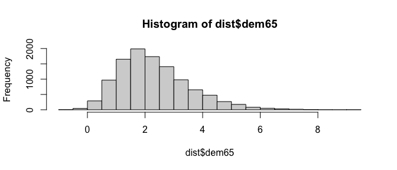

<!-- README.md is generated from README.Rmd. Please edit that file -->

> **Warning**: banSEM is just a hobby project at the moment and
> extremely experimental. There are probably already better packages out
> there that do the same thing. The main objective of banSEM was for the
> authors to explore Bayesian Networks.

# banSEM

Structural Equation Models (SEM) and Bayesian Networks are closely
related. In fact, [Pearl,
2012](http://causality.cs.ucla.edu/blog/index.php/2012/12/07/on-structural-equations-versus-causal-bayes-networks/)
states that “the difference between the two is so minute that it is not
worth the dissuasion.”

The objective of banSEM (**Ba**yesian **n**etwork **SEM**) is to easily
transition from SEM to Bayesian Networks. To this end, **banSEM**
translates SEM from `lavaan` to Bayesian networks in `bnlearn`.

## Installation

You can install the development version of banSEM from
[GitHub](https://github.com/jhorzek/banSEM/) with:

``` r
# install.packages("devtools")
devtools::install_github("jhorzek/netSEM")
```

## Example

We first estimate the SEM with lavaan. Importantly, the model **must be
fitted with a meanstructure**!

``` r
library(lavaan)
model <- '
  # latent variable definitions
     ind60 =~ x1 + x2 + x3
     dem60 =~ y1 + a*y2 + b*y3 + c*y4
     dem65 =~ y5 + a*y6 + b*y7 + c*y8

  # regressions
    dem60 ~ ind60
    dem65 ~ ind60 + dem60

  # residual correlations
    y1 ~~ y5
    y2 ~~ y4 + y6
    y3 ~~ y7
    y4 ~~ y8
    y6 ~~ y8
'

lavaan_model <- sem(model,
                    data = PoliticalDemocracy,
                    meanstructure = TRUE)
```

Next, we translate the model to a Bayesian Network:

``` r
library(banSEM)
network <- banSEM::banSEM(lavaan_model = lavaan_model)
```

To get an impression of the network, you can create a plot:

``` r
qgraph::qgraph(network$dag)
```


## Inference

With our Bayesian Network, we can now investigate the conditional
distribution of variables in our model (see
`vignette("Example", package = "banSEM")` for a comparison to rejection
sampling)

``` r
# Check conditional distribution
# probability that dem65 in (1,2) given dem60 > 1:
bnlearn::cpquery(fitted = network$bayes_net,
                 event = (dem65 > 1 & dem65 < 2),
                 evidence = (dem60 > 1))
#> [1] 0.3427986

# Get distribution under this assumption:
dist <- bnlearn::cpdist(fitted = network$bayes_net,
                        node = "dem65",
                        evidence = (dem60 > 1))
hist(dist$dem65)
```



``` r

# Now check dem60 < -1
dist <- bnlearn::cpdist(fitted = network$bayes_net,
                        node = "dem65",
                        evidence = (dem60 < -1))
hist(dist$dem65)
```


To check our Bayesian Network, we can also simulate data from the
network and refit our SEM to check if the estimates align:

``` r
sim <- bnlearn::rbn(x = network$bayes_net, n = 100000)

fit_sim <- sem(model,
               data = sim[,lavaan_model@Data@ov.names[[1]]],
               meanstructure = TRUE)
round(coef(fit_sim) - coef(lavaan_model), 3)
#>    ind60=~x2    ind60=~x3            a            b            c            a 
#>        0.005        0.011        0.001       -0.005        0.000        0.001 
#>            b            c  dem60~ind60  dem65~ind60  dem65~dem60       y1~~y5 
#>       -0.005        0.000       -0.016        0.002        0.002       -0.007 
#>       y2~~y4       y2~~y6       y3~~y7       y4~~y8       y6~~y8       x1~~x1 
#>       -0.029        0.015       -0.005        0.000        0.035        0.000 
#>       x2~~x2       x3~~x3       y1~~y1       y2~~y2       y3~~y3       y4~~y4 
#>        0.003        0.001       -0.002       -0.065        0.033       -0.013 
#>       y5~~y5       y6~~y6       y7~~y7       y8~~y8 ind60~~ind60 dem60~~dem60 
#>        0.008        0.025       -0.005        0.015       -0.003        0.004 
#> dem65~~dem65         x1~1         x2~1         x3~1         y1~1         y2~1 
#>       -0.006       -0.002       -0.004       -0.005       -0.010       -0.025 
#>         y3~1         y4~1         y5~1         y6~1         y7~1         y8~1 
#>       -0.007       -0.014       -0.005       -0.021       -0.019       -0.009
```

## Central Challenge

When transitioning from SEM to Bayesian Network, a central challenge is
the use of covariances as parameters in SEM. To translate those
covariances to a model that can be easily used with Bayesian Networks,
banSEM replaces covariances with direct effects of unobserved phantom
variables. The approach is explained in more detail, for instance, by
Merkle & Rosseel (2015; see p. 8).

Unfortunately, the automatic translation of covariances to phantom
variables is currently still unreliable and may result in negative
variances. As a result, the translation to a Bayesian Network fails. If
you encounter such issues, try to set up a model with phantom variables
manually and pass that to banSEM.

Merkle, E. C., & Rosseel, Y. (2015). blavaan: Bayesian structural
equation models via parameter expansion. arXiv preprint
arXiv:1511.05604.
