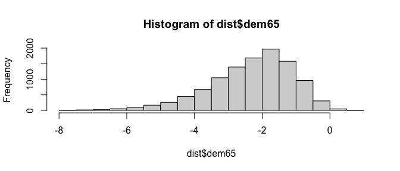

<!-- README.md is generated from README.Rmd. Please edit that file -->

> **Warning**: bnSEM is very experimental. There are probably already
> better packages out there that do the same thing. The main objective
> of bnSEM is to explore similarities between SEM and Bayesian Networks.

# bnSEM

Structural Equation Models (SEM) and Bayesian Networks are closely
related. The objective of bnSEM (**B**ayesian **N**etwork **SEM**) is to
easily transition from SEM to Bayesian Networks. To this end, **bnSEM**
translates SEM fitted with `OpenMx` (Neale et al., 2016) to Bayesian
Networks in `bnlearn` (Scutari, 2009).

## Installation

You can install the development version of bnSEM from
[GitHub](https://github.com/jhorzek/bnSEM/) with:

``` r
# install.packages("devtools")
devtools::install_github("jhorzek/bnSEM")
```

## Example

We first estimate the SEM with **OpenMx**.

``` r
library(mxsem)
model <- '
  # latent variable definitions
     ind60 =~ x1 + x2 + x3
     dem60 =~ y1 + a*y2 + b*y3 + c*y4
     dem65 =~ y5 + a*y6 + b*y7 + c*y8

  # regressions
    dem60 ~ ind60
    dem65 ~ ind60 + dem60

  # residual correlations
    y1 ~~ y5
    y2 ~~ y4 + y6
    y3 ~~ y7
    y4 ~~ y8
    y6 ~~ y8
'

mx_model <- mxsem(model,
                  data = OpenMx::Bollen) |>
  OpenMx::mxTryHard()
```

Next, we translate the model to a Bayesian Network:

``` r
library(bnSEM)
network <- bnSEM::bnSEM(mx_model = mx_model)
```

To get an impression of the network, you can create a plot:

``` r
library(qgraph)
qgraph::qgraph(network$dag)
```


## Inference

With our Bayesian Network, we can now investigate the conditional
distribution of variables in our model (see
`vignette("Inference-Example", package = "bnSEM")` for a comparison to
rejection sampling)

``` r
# Check conditional distribution
# probability that dem65 in (1,2) given dem60 > 1:
bnlearn::cpquery(fitted = network$bayes_net,
                 event = (dem65 > 1 & dem65 < 2),
                 evidence = (dem60 > 1))
#> [1] 0.3457536

# Get distribution under this assumption:
dist <- bnlearn::cpdist(fitted = network$bayes_net,
                        node = "dem65",
                        evidence = (dem60 > 1))
hist(dist$dem65)
```


``` r

# Now check dem60 < -1
dist <- bnlearn::cpdist(fitted = network$bayes_net,
                        node = "dem65",
                        evidence = (dem60 < -1))
hist(dist$dem65)
```



Additionally, we can investigate interventional distributions. This is
fairly experimental and has not really been tested - so take everything
in the following with a large grain of salt.

In bnlearn, the interventional distribution can be investigated using
mutilated networks. For example, let’s assume we intervene on the latent
`dem60` variable by setting its value to 2:

``` r
mut <- mutilated(x = network$bayes_net, 
                 evidence = list("dem60" = 2))
```

We can then investigate the distribution of the dependent variable
`dem65`

``` r
inter_dist <- cpdist(fitted = mut,
                     nodes = "dem65",
                     evidence = TRUE,
                     method = "lw")
# mean
(m <- sum(inter_dist$dem65 * attr(inter_dist, "weights")) / sum(attr(inter_dist, "weights")))
#> [1] 1.72881
# variance
sum(attr(inter_dist, "weights") * (inter_dist$dem65 - m)^2)/ 
  sum(attr(inter_dist, "weights"))
#> [1] 0.3255103
```

This is higher than the original estimates for the mean and variance of
`dem65` because `dem60` has an effect on `dem65`:

``` r
mx_model$M$values[,"dem65"]
#> dem65 
#>     0
mx_model$S$values["dem65", "dem65"]
#> [1] 0.1644651
```

Now, let’s also look at the expected value for `ind60`:

``` r
inter_dist <- cpdist(fitted = mut,
                     nodes = "ind60",
                     evidence = TRUE,
                     method = "lw")
# mean
(m <- sum(inter_dist$ind60 * attr(inter_dist, "weights")) / sum(attr(inter_dist, "weights")))
#> [1] -0.0010376
# variance
sum(attr(inter_dist, "weights") * (inter_dist$ind60 - m)^2)/ 
  sum(attr(inter_dist, "weights"))
#> [1] 0.4445823
```

Because `dem65` has no effect on `ind60`, this is identical to the
estimated mean and covariance for `ind60` in the original model:

``` r
mx_model$M$values[,"ind60"]
#> ind60 
#>     0
mx_model$S$values["ind60", "ind60"]
#> [1] 0.4485991
```

## Checking the model

To check our Bayesian Network, we can also simulate data from the
network and refit our SEM to check if the estimates align:

``` r
sim <- bnlearn::rbn(x = network$bayes_net, n = 100000)

fit_sim <- mxsem(model,
                 data = sim[,mx_model$manifestVars]) |>
  OpenMx::mxTryHard()
```

``` r
round(coef(fit_sim) - coef(mx_model), 3)
#>    ind60→x2    ind60→x3 ind60→dem60 ind60→dem65           a           b 
#>     -27.007      21.726     -90.509     140.349      -0.059      -0.059 
#>           c dem60→dem65       y1↔y1       y2↔y2       y3↔y3       y2↔y4 
#>      -0.016       0.172      -0.319      -0.222       0.323       0.069 
#>       y4↔y4       y2↔y6       y6↔y6       x1↔x1       x2↔x2       x3↔x3 
#>      -0.056       0.236       1.700       0.652       1.817       1.259 
#>       y1↔y5       y5↔y5       y3↔y7       y7↔y7       y4↔y8       y6↔y8 
#>      -0.111       0.408       0.100      -0.095       0.198       1.696 
#>       y8↔y8 ind60↔ind60 dem60↔dem60 dem65↔dem65      one→y1      one→y2 
#>       1.602      -0.449       0.132       0.014      -0.083       0.274 
#>      one→y3      one→y4      one→y6      one→x1      one→x2      one→x3 
#>      -0.045       0.144       0.131      -0.175       0.050      -0.039 
#>      one→y5      one→y7      one→y8 
#>       0.352       0.071       0.137
```

## Central Challenge

When transitioning from SEM to Bayesian Network, a central challenge is
the use of covariances as parameters in SEM. To translate those
covariances to a model that can be easily used with Bayesian Networks,
bnSEM replaces covariances with direct effects of unobserved phantom
variables. The approach is explained in more detail, for instance, by
Merkle & Rosseel (2015; see p. 8).

## References

- **OpenMx**: Neale, M. C., Hunter, M. D., Pritikin, J. N., Zahery, M.,
  Brick, T. R., Kirkpatrick, R. M., … & Boker, S. M. (2016). OpenMx 2.0:
  Extended structural equation and statistical modeling. Psychometrika,
  81, 535-549.
- **bnlearn**; Scutari, M. (2009). Learning Bayesian networks with the
  bnlearn R package. arXiv preprint arXiv:0908.3817.
- Merkle, E. C., & Rosseel, Y. (2015). blavaan: Bayesian structural
  equation models via parameter expansion. arXiv preprint
  arXiv:1511.05604.
